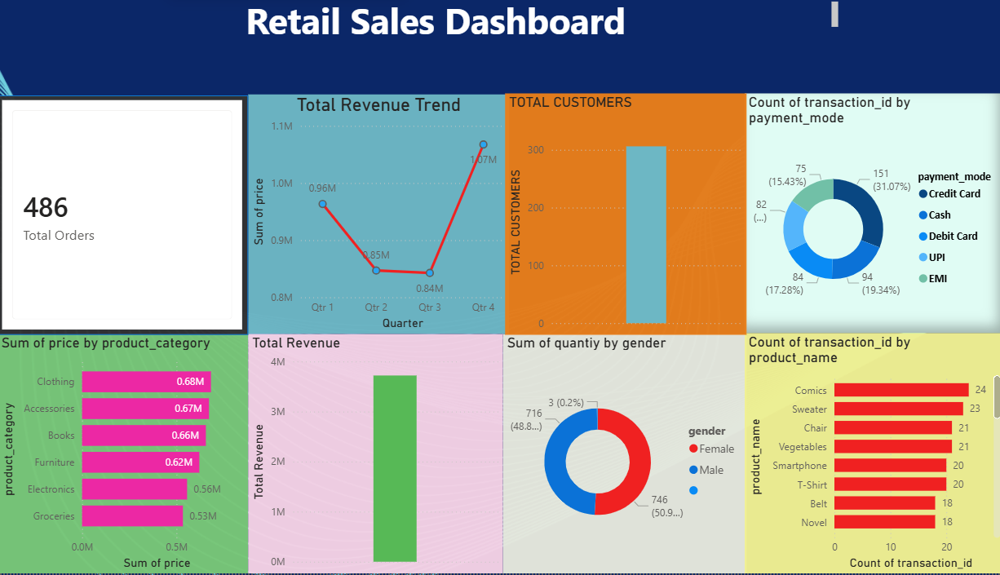

# retail-sales-analysis
Retail Sales Analysis using Excel, MySQL and power BI

## Tools Used
- Microsoft Excel - Data Cleaning
- MySQL - Data Analysis
- Power BI - Dashboard and Visualization
- DAX - Measures and KPIs

## Project Overview
Analyzed 2000+ retail sales records to extract meaningful business insights using Excel, MySQL and Power BI.

## Data Cleaning
- Converted date and time columns from TEXT to DATE and TIME format
- Renamed misspelled column name using ALTER TABLE
- Changed Gender values from M/F to Male/Female
- Changed CC to Credit Card in payment mode column

## Business Questions Answered
1. Top 5 most selling products by quantity
2. Most frequently cancelled products
3. Peak purchase time of day
4. Top 5 highest spending customers
5. Highest revenue product categories
6. Return and cancellation rate by category
7. Most preferred payment mode
8. Age group purchasing behaviour
9. Monthly sales trend
10. Gender wise product preferences

## SQL Concepts Used
- STR_TO_DATE, ALTER TABLE, UPDATE
- SUM, COUNT, DISTINCT COUNT
- CASE WHEN, GROUP BY, ORDER BY, LIMIT
- DATE_FORMAT, HOUR
- Conditional Aggregation

## Power BI Dashboard
- 8 Interactive Visuals
- KPI Cards for Orders, Revenue and Customers
- Bar Charts, Donut Charts and Line Chart
- DAX Measures

## DAX Measures Created
- Total Revenue
- Total Orders
- Total Customers
- Cancellation Rate
- Delivery Rate
- Average Order Value

## Dashboard Preview

## Files in Repository
- sales.csv - Raw sales data
- Sales_Analysis_Project.sql - All SQL queries
- Retai_Sales_Dashboard.pbix - Power BI dashboard
- dashboard.png - Dashboard screenshot
